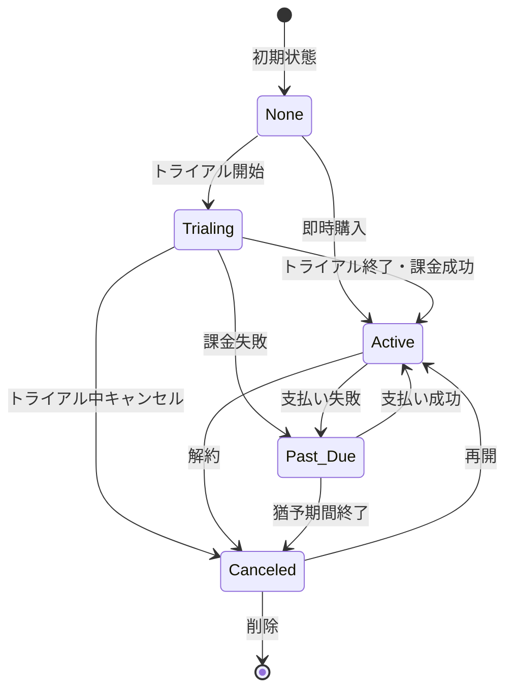
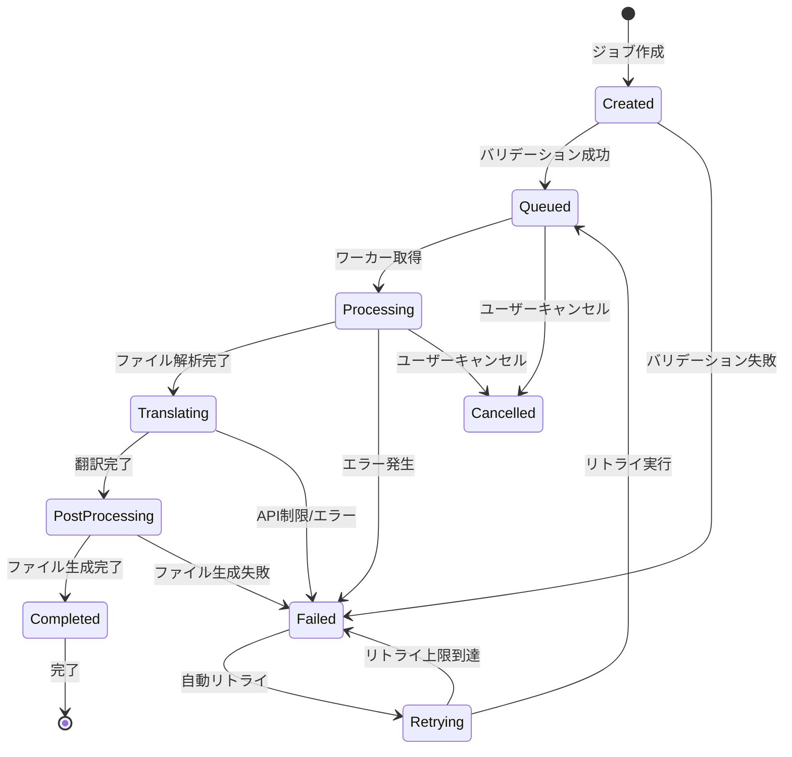

# PPT Translator App - 決済システム・言語対応仕様書

## 1. 決済システム（Stripe）仕様

### 1.1 概要
PPT Translator AppはStripeを使用したサブスクリプション型の課金モデルを採用します。

### 1.2 料金プラン

| プラン名 | 月額料金 | 年額料金 | 機能 |
|---------|---------|---------|------|
| **Free** | ¥0 | ¥0 | • 月5ファイルまで<br>• 最大10スライド/ファイル<br>• 基本翻訳モデル<br>• ウォーターマーク付き |
| **Starter** | ¥1,980 | ¥19,800<br>(17%割引) | • 月30ファイルまで<br>• 最大50スライド/ファイル<br>• 高品質翻訳モデル<br>• ウォーターマークなし |
| **Professional** | ¥4,980 | ¥49,800<br>(17%割引) | • 月100ファイルまで<br>• スライド数無制限<br>• 最高品質翻訳モデル<br>• 優先処理<br>• APIアクセス |
| **Enterprise** | 要相談 | 要相談 | • カスタム制限<br>• 専用サポート<br>• SLA保証<br>• オンプレミス対応可 |

### 1.3 Stripe実装詳細

#### 1.3.1 製品・価格設定
```typescript
// Stripe製品ID（環境変数で管理）
const STRIPE_PRODUCTS = {
  starter: process.env.STRIPE_PRODUCT_STARTER_ID,
  professional: process.env.STRIPE_PRODUCT_PRO_ID,
  enterprise: process.env.STRIPE_PRODUCT_ENTERPRISE_ID,
};

// 価格ID
const STRIPE_PRICES = {
  starter_monthly: process.env.STRIPE_PRICE_STARTER_MONTHLY,
  starter_yearly: process.env.STRIPE_PRICE_STARTER_YEARLY,
  professional_monthly: process.env.STRIPE_PRICE_PRO_MONTHLY,
  professional_yearly: process.env.STRIPE_PRICE_PRO_YEARLY,
};
```

#### 1.3.2 Checkout Session作成
```typescript
// /api/stripe/create-checkout-session
export async function POST(req: Request) {
  const { priceId, userId } = await req.json();
  
  const session = await stripe.checkout.sessions.create({
    payment_method_types: ['card'],
    line_items: [{
      price: priceId,
      quantity: 1,
    }],
    mode: 'subscription',
    success_url: `${process.env.NEXT_PUBLIC_APP_URL}/dashboard?success=true`,
    cancel_url: `${process.env.NEXT_PUBLIC_APP_URL}/pricing?canceled=true`,
    client_reference_id: userId,
    metadata: {
      userId,
    },
    subscription_data: {
      trial_period_days: 14, // 14日間の無料トライアル
    },
    billing_address_collection: 'required',
    allow_promotion_codes: true,
  });
  
  return NextResponse.json({ sessionId: session.id });
}
```

#### 1.3.3 Webhook処理
```typescript
// /api/stripe/webhook
export async function POST(req: Request) {
  const body = await req.text();
  const signature = req.headers.get('stripe-signature')!;
  
  const event = stripe.webhooks.constructEvent(
    body,
    signature,
    process.env.STRIPE_WEBHOOK_SECRET!
  );
  
  switch (event.type) {
    case 'checkout.session.completed':
      await handleCheckoutSessionCompleted(event.data.object);
      break;
    case 'customer.subscription.created':
      await handleSubscriptionCreated(event.data.object);
      break;
    case 'customer.subscription.updated':
      await handleSubscriptionUpdated(event.data.object);
      break;
    case 'customer.subscription.deleted':
      await handleSubscriptionDeleted(event.data.object);
      break;
    case 'invoice.payment_succeeded':
      await handlePaymentSucceeded(event.data.object);
      break;
    case 'invoice.payment_failed':
      await handlePaymentFailed(event.data.object);
      break;
  }
  
  return NextResponse.json({ received: true });
}
```

#### 1.3.4 カスタマーポータル
```typescript
// 顧客が自身でサブスクリプション管理できるポータル
export async function createPortalSession(customerId: string) {
  const session = await stripe.billingPortal.sessions.create({
    customer: customerId,
    return_url: `${process.env.NEXT_PUBLIC_APP_URL}/dashboard`,
  });
  
  return session.url;
}
```

### 1.4 使用量制限の実装

```typescript
interface UsageLimit {
  plan: 'free' | 'starter' | 'professional' | 'enterprise';
  maxFilesPerMonth: number;
  maxSlidesPerFile: number;
  maxCharactersPerMonth: number;
  features: {
    watermark: boolean;
    apiAccess: boolean;
    priorityProcessing: boolean;
    customGlossary: boolean;
  };
}

const PLAN_LIMITS: Record<string, UsageLimit> = {
  free: {
    plan: 'free',
    maxFilesPerMonth: 5,
    maxSlidesPerFile: 10,
    maxCharactersPerMonth: 50000,
    features: {
      watermark: true,
      apiAccess: false,
      priorityProcessing: false,
      customGlossary: false,
    },
  },
  starter: {
    plan: 'starter',
    maxFilesPerMonth: 30,
    maxSlidesPerFile: 50,
    maxCharactersPerMonth: 500000,
    features: {
      watermark: false,
      apiAccess: false,
      priorityProcessing: false,
      customGlossary: true,
    },
  },
  professional: {
    plan: 'professional',
    maxFilesPerMonth: 100,
    maxSlidesPerFile: -1, // 無制限
    maxCharactersPerMonth: 2000000,
    features: {
      watermark: false,
      apiAccess: true,
      priorityProcessing: true,
      customGlossary: true,
    },
  },
};
```

## 2. 言語対応仕様

### 2.1 対応言語一覧

| 言語コード | 言語名（日本語） | 言語名（英語） | 言語名（ネイティブ） | サポートレベル |
|-----------|--------------|---------------|-----------------|--------------|
| `ja` | 日本語 | Japanese | 日本語 | フル対応 |
| `en` | 英語 | English | English | フル対応 |
| `zh-CN` | 中国語（簡体字） | Chinese (Simplified) | 简体中文 | フル対応 |
| `zh-TW` | 中国語（繁体字） | Chinese (Traditional) | 繁體中文 | フル対応 |
| `ko` | 韓国語 | Korean | 한국어 | フル対応 |
| `th` | タイ語 | Thai | ภาษาไทย | フル対応 |
| `vi` | ベトナム語 | Vietnamese | Tiếng Việt | フル対応 |
| `es` | スペイン語 | Spanish | Español | フル対応 |
| `pt` | ポルトガル語 | Portuguese | Português | フル対応 |
| `de` | ドイツ語 | German | Deutsch | フル対応 |
| `fr` | フランス語 | French | Français | フル対応 |

### 2.2 自動言語検出

#### 2.2.1 検出アルゴリズム
```typescript
import { detect } from 'langdetect';

interface LanguageDetectionResult {
  language: string;
  confidence: number;
  alternatives: Array<{
    language: string;
    confidence: number;
  }>;
}

export async function detectLanguage(texts: string[]): Promise<LanguageDetectionResult> {
  // 複数のテキストサンプルから言語を検出
  const sampleText = texts.slice(0, 10).join(' ');
  
  // 言語検出ライブラリを使用
  const detectionResults = await detect(sampleText);
  
  // Claude APIでの確認（高精度）
  if (detectionResults[0].confidence < 0.8) {
    const claudeResult = await confirmLanguageWithClaude(sampleText);
    if (claudeResult.confidence > detectionResults[0].confidence) {
      return claudeResult;
    }
  }
  
  return {
    language: detectionResults[0].lang,
    confidence: detectionResults[0].confidence,
    alternatives: detectionResults.slice(1, 4).map(r => ({
      language: r.lang,
      confidence: r.confidence,
    })),
  };
}
```

#### 2.2.2 言語検出フォールバック
```typescript
// ユーザーが手動で言語を選択できるUI
const LanguageSelector: React.FC<{
  detectedLanguage?: string;
  onSelect: (lang: string) => void;
}> = ({ detectedLanguage, onSelect }) => {
  return (
    <div>
      {detectedLanguage && (
        <p className="text-sm text-gray-600">
          検出された言語: {LANGUAGES[detectedLanguage].native}
        </p>
      )}
      <Select onValueChange={onSelect} defaultValue={detectedLanguage}>
        <SelectTrigger>
          <SelectValue placeholder="言語を選択してください" />
        </SelectTrigger>
        <SelectContent>
          {Object.entries(LANGUAGES).map(([code, lang]) => (
            <SelectItem key={code} value={code}>
              {lang.native} ({lang.english})
            </SelectItem>
          ))}
        </SelectContent>
      </Select>
    </div>
  );
};
```

### 2.3 翻訳品質最適化

#### 2.3.1 言語ペア別の最適化
```typescript
const LANGUAGE_PAIR_OPTIMIZATIONS = {
  'ja-en': {
    model: 'claude-3-opus', // 日英は最高品質モデル
    preserveHonorifics: true,
    contextWindow: 'large',
  },
  'zh-CN-ja': {
    model: 'claude-3-sonnet',
    handleTraditionalChars: true,
    preserveIdioms: true,
  },
  'en-ko': {
    model: 'claude-3-sonnet',
    formalityLevel: 'formal',
    preserveTechnicalTerms: true,
  },
  // その他の言語ペア設定...
};
```

#### 2.3.2 専門用語辞書
```typescript
interface GlossaryEntry {
  source: string;
  target: string;
  context?: string;
  caseSensitive: boolean;
}

const TECHNICAL_GLOSSARIES: Record<string, GlossaryEntry[]> = {
  'business': [
    { source: 'ROI', target: '投資収益率', context: 'finance', caseSensitive: true },
    { source: 'KPI', target: '重要業績評価指標', context: 'management', caseSensitive: true },
  ],
  'technology': [
    { source: 'API', target: 'API', context: 'software', caseSensitive: true }, // 変換しない
    { source: 'Machine Learning', target: '機械学習', context: 'AI', caseSensitive: false },
  ],
  'medical': [
    { source: 'MRI', target: 'MRI', context: 'imaging', caseSensitive: true },
    { source: 'diagnosis', target: '診断', context: 'general', caseSensitive: false },
  ],
};
```

### 2.4 言語別フォント設定

```typescript
const LANGUAGE_FONTS = {
  'ja': {
    primary: 'Noto Sans JP',
    fallback: ['Yu Gothic', 'Hiragino Sans', 'sans-serif'],
    size: { base: 14, heading: 24 },
  },
  'zh-CN': {
    primary: 'Noto Sans SC',
    fallback: ['Microsoft YaHei', 'PingFang SC', 'sans-serif'],
    size: { base: 14, heading: 24 },
  },
  'ko': {
    primary: 'Noto Sans KR',
    fallback: ['Malgun Gothic', 'Apple SD Gothic Neo', 'sans-serif'],
    size: { base: 13, heading: 22 },
  },
  'th': {
    primary: 'Noto Sans Thai',
    fallback: ['Tahoma', 'sans-serif'],
    size: { base: 14, heading: 26 },
  },
  'ar': {
    primary: 'Noto Sans Arabic',
    fallback: ['Arial', 'sans-serif'],
    size: { base: 15, heading: 28 },
    direction: 'rtl', // 右から左へ
  },
};
```

### 2.5 翻訳プロンプトテンプレート

```typescript
const TRANSLATION_PROMPTS = {
  default: `
    You are a professional translator specializing in business presentations.
    Translate the following text from {sourceLanguage} to {targetLanguage}.
    
    Requirements:
    1. Maintain the professional tone appropriate for business presentations
    2. Preserve any technical terms that should not be translated
    3. Keep formatting markers like [BOLD], [ITALIC] intact
    4. Ensure cultural appropriateness for the target audience
    
    Source text:
    {text}
    
    Translation:
  `,
  
  technical: `
    You are a technical translator with expertise in {domain}.
    Translate the following technical content from {sourceLanguage} to {targetLanguage}.
    
    Glossary to use:
    {glossary}
    
    Requirements:
    1. Use the provided glossary for consistency
    2. Maintain technical accuracy
    3. Preserve acronyms unless translation is standard practice
    
    Source text:
    {text}
    
    Translation:
  `,
  
  marketing: `
    You are a marketing translator who understands cultural nuances.
    Translate this marketing content from {sourceLanguage} to {targetLanguage}.
    
    Requirements:
    1. Adapt the message for the target culture
    2. Maintain persuasive impact
    3. Consider local market preferences
    4. Keep brand voice consistent
    
    Source text:
    {text}
    
    Translation:
  `,
};
```

## 3. ビジネスルールと状態遷移

### 3.1 サブスクリプション状態遷移



#### 状態定義とビジネスルール

| 状態 | 説明 | 使用可能機能 | 遷移条件 |
|------|------|------------|----------|
| **None** | 未登録/Free | Freeプラン機能のみ | - |
| **Trialing** | トライアル中 | 選択プランのフル機能 | 14日間 |
| **Active** | 有効 | プランのフル機能 | 支払い正常 |
| **Past_Due** | 支払い遅延 | 制限付き（読み取りのみ） | 3日間猶予 |
| **Canceled** | 解約済み | Freeプラン機能 | 即時 |
| **Paused** | 一時停止 | 制限付き | 最大3ヶ月 |

### 3.2 使用量制限のビジネスルール

```typescript
interface UsageRule {
  checkTiming: 'before_upload' | 'before_translation' | 'realtime';
  enforcement: 'hard_limit' | 'soft_limit' | 'warning';
  resetCycle: 'monthly' | 'daily' | 'never';
  carryOver: boolean;
}

const USAGE_RULES: Record<string, UsageRule> = {
  file_count: {
    checkTiming: 'before_upload',
    enforcement: 'hard_limit',
    resetCycle: 'monthly',
    carryOver: false
  },
  character_count: {
    checkTiming: 'before_translation',
    enforcement: 'soft_limit', // 10%超過まで許可
    resetCycle: 'monthly',
    carryOver: false
  },
  api_calls: {
    checkTiming: 'realtime',
    enforcement: 'hard_limit',
    resetCycle: 'daily',
    carryOver: false
  }
};

// 使用量チェック実装
async function checkUsageLimit(
  userId: string,
  usageType: string,
  amount: number
): Promise<{ allowed: boolean; remaining: number; resetDate: Date }> {
  const user = await getUserWithSubscription(userId);
  const rule = USAGE_RULES[usageType];
  const limit = PLAN_LIMITS[user.plan][usageType];
  
  // 現在の使用量を取得
  const currentUsage = await getCurrentUsage(userId, usageType, rule.resetCycle);
  
  // ビジネスルール適用
  let allowed = false;
  const remaining = limit - currentUsage - amount;
  
  switch (rule.enforcement) {
    case 'hard_limit':
      allowed = remaining >= 0;
      break;
    case 'soft_limit':
      allowed = remaining >= -(limit * 0.1); // 10%超過まで許可
      if (allowed && remaining < 0) {
        await notifyOverage(userId, usageType, Math.abs(remaining));
      }
      break;
    case 'warning':
      allowed = true;
      if (remaining < limit * 0.2) { // 残り20%で警告
        await sendUsageWarning(userId, usageType, remaining);
      }
      break;
  }
  
  return {
    allowed,
    remaining: Math.max(0, remaining),
    resetDate: getResetDate(rule.resetCycle)
  };
}
```

### 3.3 課金タイミングと日割り計算

```typescript
interface BillingRule {
  proration: 'enabled' | 'disabled';
  upgradeImmediately: boolean;
  downgradeAtPeriodEnd: boolean;
  refundPolicy: 'no_refund' | 'prorated' | 'full_within_days';
}

const BILLING_RULES: BillingRule = {
  proration: 'enabled', // 日割り計算有効
  upgradeImmediately: true, // アップグレードは即時適用
  downgradeAtPeriodEnd: true, // ダウングレードは期間終了時
  refundPolicy: 'prorated' // 日割り返金
};

// プラン変更処理
async function changePlan(
  userId: string,
  newPlan: string,
  currentPlan: string
): Promise<PlanChangeResult> {
  const isUpgrade = PLAN_HIERARCHY[newPlan] > PLAN_HIERARCHY[currentPlan];
  
  if (isUpgrade && BILLING_RULES.upgradeImmediately) {
    // 即時アップグレード with 日割り請求
    const proratedAmount = calculateProration(currentPlan, newPlan);
    await stripe.invoiceItems.create({
      customer: customerId,
      amount: proratedAmount,
      description: `Upgrade from ${currentPlan} to ${newPlan}`
    });
    
    // プラン即時変更
    await updateSubscription(userId, newPlan);
    return { status: 'upgraded', effective: 'immediate' };
  } else if (!isUpgrade && BILLING_RULES.downgradeAtPeriodEnd) {
    // ダウングレードは次回請求サイクルで
    await scheduleDowngrade(userId, newPlan);
    return { status: 'scheduled', effective: 'next_period' };
  }
}
```

### 3.4 翻訳ジョブの状態遷移



#### ジョブ処理ルール

```typescript
interface JobProcessingRule {
  maxRetries: number;
  retryDelay: number[]; // 各リトライの遅延時間（秒）
  timeout: number; // 全体タイムアウト（秒）
  priority: 'low' | 'normal' | 'high';
  cancellable: boolean;
}

const JOB_RULES: Record<string, JobProcessingRule> = {
  free: {
    maxRetries: 2,
    retryDelay: [30, 60], // 30秒後、60秒後
    timeout: 300, // 5分
    priority: 'low',
    cancellable: true
  },
  starter: {
    maxRetries: 3,
    retryDelay: [10, 30, 60],
    timeout: 600, // 10分
    priority: 'normal',
    cancellable: true
  },
  professional: {
    maxRetries: 5,
    retryDelay: [5, 10, 20, 40, 80],
    timeout: 1800, // 30分
    priority: 'high',
    cancellable: true
  }
};

// ジョブ実行エンジン
class JobExecutor {
  async processJob(job: TranslationJob): Promise<void> {
    const rules = JOB_RULES[job.userPlan];
    let retryCount = 0;
    
    while (retryCount <= rules.maxRetries) {
      try {
        // タイムアウト設定
        const result = await Promise.race([
          this.executeJob(job),
          this.timeout(rules.timeout * 1000)
        ]);
        
        // 成功時の処理
        await this.updateJobStatus(job.id, 'completed', result);
        await this.notifyCompletion(job);
        return;
        
      } catch (error) {
        retryCount++;
        
        // リトライ可能なエラーか判定
        if (this.isRetryableError(error) && retryCount <= rules.maxRetries) {
          const delay = rules.retryDelay[retryCount - 1] * 1000;
          await this.updateJobStatus(job.id, 'retrying', { retryCount, nextRetry: Date.now() + delay });
          await this.sleep(delay);
        } else {
          // 最終失敗
          await this.updateJobStatus(job.id, 'failed', { error: error.message, retryCount });
          await this.notifyFailure(job, error);
          throw error;
        }
      }
    }
  }
  
  isRetryableError(error: any): boolean {
    // リトライ可能なエラーパターン
    const retryableErrors = [
      'RATE_LIMIT_EXCEEDED',
      'TIMEOUT',
      'NETWORK_ERROR',
      'SERVICE_UNAVAILABLE'
    ];
    return retryableErrors.includes(error.code);
  }
}
```

### 3.5 プラン別機能制限マトリクス

| 機能 | Free | Starter | Professional | Enterprise |
|------|------|---------|--------------|------------|
| **基本機能** |
| ファイルアップロード | ✅ | ✅ | ✅ | ✅ |
| 基本翻訳 | ✅ | ✅ | ✅ | ✅ |
| プレビュー | ✅ | ✅ | ✅ | ✅ |
| ダウンロード | ✅ | ✅ | ✅ | ✅ |
| **高度な機能** |
| 翻訳メモリ（TM） | ❌ | ✅ 1,000件 | ✅ 10,000件 | ✅ 無制限 |
| 用語集（TB） | ❌ | ✅ 100語 | ✅ 1,000語 | ✅ 無制限 |
| 一括翻訳 | ❌ | ❌ | ✅ | ✅ |
| API アクセス | ❌ | ❌ | ✅ | ✅ |
| カスタムモデル選択 | ❌ | ❌ | ✅ | ✅ |
| **処理優先度** |
| キュー優先度 | 低 | 通常 | 高 | 最高 |
| 並列処理数 | 1 | 2 | 5 | 無制限 |
| 処理速度 | 標準 | 標準 | 高速 | 専用リソース |
| **サポート** |
| メールサポート | ❌ | ✅ 48時間 | ✅ 24時間 | ✅ 1時間 |
| 電話サポート | ❌ | ❌ | ❌ | ✅ |
| 専任担当者 | ❌ | ❌ | ❌ | ✅ |

### 3.6 エラー時の返金・補償ポリシー

```typescript
interface CompensationPolicy {
  condition: string;
  compensation: 'refund' | 'credit' | 'extension';
  amount: number; // パーセンテージまたは日数
}

const COMPENSATION_POLICIES: CompensationPolicy[] = [
  {
    condition: 'downtime_over_4hours',
    compensation: 'credit',
    amount: 10 // 10%クレジット
  },
  {
    condition: 'downtime_over_24hours',
    compensation: 'refund',
    amount: 100 // 全額返金
  },
  {
    condition: 'data_loss',
    compensation: 'refund',
    amount: 100 // 全額返金 + 3ヶ月無料
  },
  {
    condition: 'translation_quality_issue',
    compensation: 'credit',
    amount: 50 // 該当ジョブ分のクレジット
  }
];

// SLA違反時の自動補償
async function processSLAViolation(
  incident: Incident
): Promise<CompensationResult> {
  const affectedUsers = await getAffectedUsers(incident);
  const policy = COMPENSATION_POLICIES.find(p => p.condition === incident.type);
  
  if (!policy) return { processed: false };
  
  for (const userId of affectedUsers) {
    switch (policy.compensation) {
      case 'refund':
        await processRefund(userId, policy.amount);
        break;
      case 'credit':
        await addAccountCredit(userId, policy.amount);
        break;
      case 'extension':
        await extendSubscription(userId, policy.amount);
        break;
    }
    
    await notifyCompensation(userId, incident, policy);
  }
  
  return { 
    processed: true, 
    affectedCount: affectedUsers.length,
    totalCompensation: calculateTotalCompensation(affectedUsers, policy)
  };
}
```

## 4. 実装チェックリスト

### 4.1 Stripe統合
- [ ] Stripe アカウント作成・設定
- [ ] 製品・価格の設定
- [ ] Webhook エンドポイントの設定
- [ ] Customer Portal の設定
- [ ] テスト環境での動作確認
- [ ] 本番環境への切り替え

### 4.2 言語対応
- [ ] 言語検出ライブラリの統合
- [ ] 各言語のフォント設定
- [ ] 専門用語辞書の準備
- [ ] 翻訳品質テスト（全言語ペア）
- [ ] RTL言語（アラビア語等）の対応
- [ ] 言語別UIローカライゼーション

### 4.3 セキュリティ
- [ ] Stripe Webhook署名検証
- [ ] PCI DSS準拠の確認
- [ ] 決済情報の非保持確認
- [ ] SSL/TLS証明書の設定

---
*ドキュメントバージョン: 1.0*  
*最終更新日: 2025年1月*